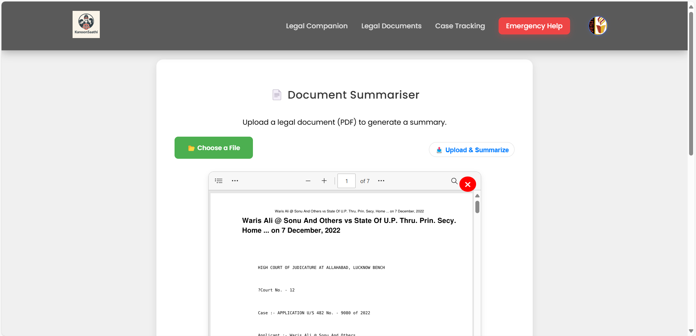
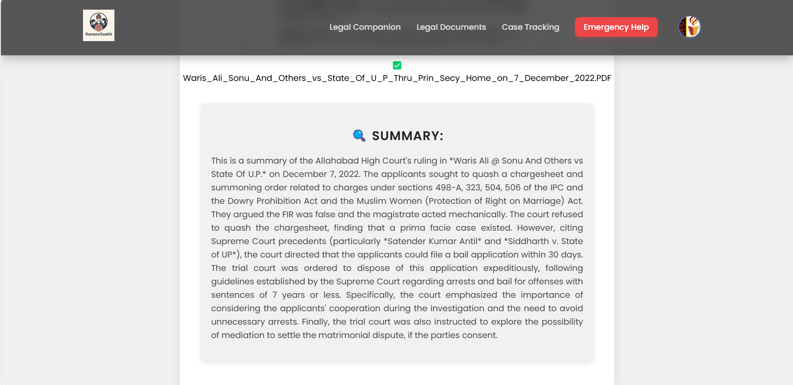
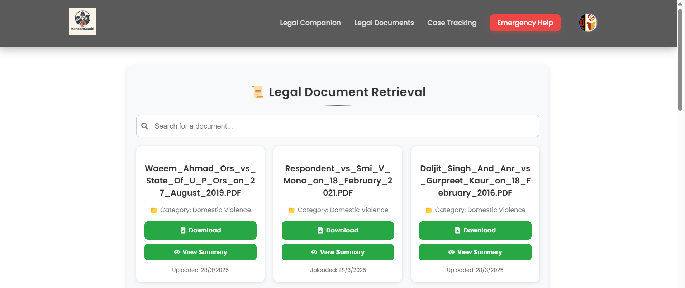
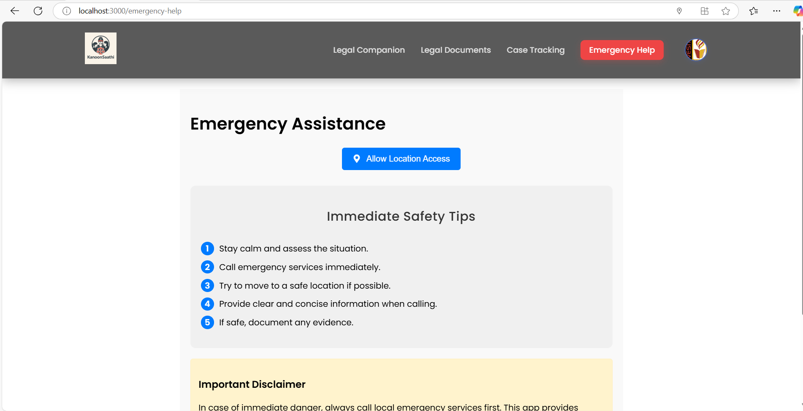

KanoonSaathi – Empowering Women & Children Through Legal Assistance

👥 Team: Hack Attackers

📌 Overview

KanoonSaathi is a comprehensive legal assistance platform designed to empower women and children by providing AI-based legal support, document management, and emergency legal assistance.

🚀 Features

🔒 Authentication & User Management

Secure Login & Signup with OTP verification.

📄 Legal Document Handling

Document Summariser: Upload legal documents and get AI-generated summaries.

Document Retrieval: Search for legal documents using keywords.

⚖️ Legal Assistance & Case Management

Legal Companion: AI-based chatbot for legal help.
  

Case Tracking: Track chat summaries and recently uploaded documents with summaries.

🆘 Emergency Legal Help

One-click emergency call feature based on your location.
